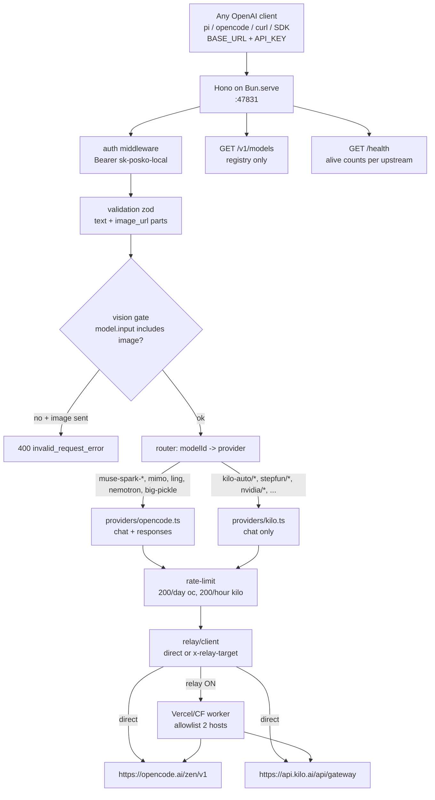
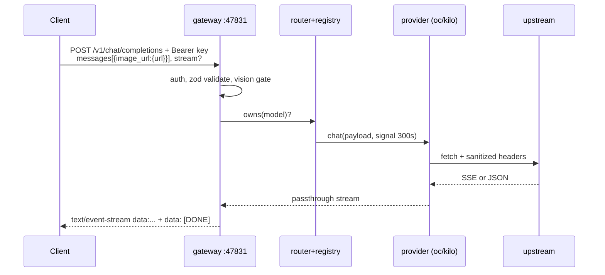

# posko-ai — DESIGN v0.1

> Standalone OpenAI-compatible gateway in **Bun + TypeScript**, modular rewrite of `pi-bansos-0.4.9`.
> Reference: `../pi-bansos-0.4.9/ARCHITECTURE.md` + `../pi-bansos-0.4.9/package/extensions/index.ts`.
> Status: **IMPLEMENTED v0.1 — code in `src/`, `bun test` 24 pass, smoke-tested on `:47831` (live health: oc=7/kilo=17).**
> Decisions locked: `hono`, scope `Full (chat + responses + vision)`, port `47831`, name `posko-ai`.

## 0. TL;DR

* One HTTP service exposes `BASE_URL` (e.g. `http://127.0.0.1:47831/v1`) + one dummy `API_KEY` (e.g. `sk-posko-local`).
* Any OpenAI client (`pi`, `opencode`, `curl`, SDKs) connects with those two values.
* Gateway routes by `model` id to 2 upstreams: **OpenCode Zen** (7 models) + **KiloCode gateway** (19 models), same 26 as pi-bansos.
* Full OpenAI surface: `GET /v1/models`, `POST /v1/chat/completions` (text+image in/out, streaming SSE), `POST /v1/responses` (for `muse-spark-*`), `GET /health`.
* Modular: `providers/*` isolated behind an interface; `routes/*` thin; `core/*` shared (registry, router, stream, validation, rate-limit).

## 1. Goals / Non-goals

Goals:

* [x] Bun-native, `TypeScript strict`, small deps, `bun run dev` + single-binary `bun build --compile`.
* [x] Modular: add a 3rd upstream by adding one file in `src/providers/`, no router edits.
* [x] Text + image **input** (`content: string | ContentPart[]` with `text` / `image_url`) and text **output** (incl. streaming), per OpenAI spec.
* [x] Vision gating: reject (400) image input for non-vision models with OpenAI-style error, instead of silent upstream 400/500.
* [x] Spec-compliant errors `{error:{message,type,code}}`, SSE `data: [DONE]`, CORS, `Authorization: Bearer <key>`.
* [x] Reuse proven pi-bansos behavior: catalog-only `/v1/models`, per-upstream rate limits (opencode 200/UTC-day, kilo 200/hour/IP), relay egress (optional), health-check at boot.

Non-goals (v1):

* No embeddings, audio, files, fine-tunes, admin API.
* No DB. State = in-memory + one JSON file for relay (same as pi-bansos).
* No multi-user billing. One shared dummy key (env-overridable), optional read-only key later.

## 2. Name + endpoint contract (locked)

Name: **`posko-ai`** (`posko` = aid post — same aid spirit as `bansos`, but unique + searchable).

Exposed contract — this is what users paste into any client:

```text
BASE_URL = http://127.0.0.1:47831/v1   # uncommon 5-digit, avoids 18080/3000/8000/3210
API_KEY  = sk-posko-local   # overridable via GATEWAY_API_KEY
```

```bash
curl $BASE_URL/models -H "Authorization: Bearer $API_KEY"
curl $BASE_URL/chat/completions \
  -H "Authorization: Bearer $API_KEY" -H "Content-Type: application/json" \
  -d '{"model":"mimo-v2.5-free","messages":[{"role":"user","content":"hi"}]}'
```

`GET /` returns `{name, version, upstreams, modelCount, docs}` so the URL is self-describing.

## 3. Tech stack

| Choice | Why |
|---|---|
| `bun >=1.4`, `typescript strict` | runtime + types, `Bun.serve` perf |
| `hono` + `@hono/node-server` compat (runs on `Bun.serve`) | tiny router, middleware, SSE helpers; easier OpenAI validation than raw `http` |
| `zod` | validate Chat/Responses payloads, return 400 with OpenAI error shape |
| `pino` (or `hono/logger` in dev) | structured logs `[gateway] level msg meta` like pi-bansos `log()` |
| `bun:test` | unit + contract tests, no extra runner |

No ORM, no framework lock-in: `providers/` only depend on `core/types.ts` + `fetch`.

## 4. Module layout

```text
posko-ai/
  DESIGN.md            # this file
  package.json         # bun scripts: dev/start/build/test/lint
  tsconfig.json        # strict, nodenext
  bunfig.toml
  .env.example
  src/
    index.ts           # Bun.serve + hono app wiring only (~50 lines)
    config.ts          # env: PORT/HOST/API_KEY/UPSTREAMS/RELAY/RATE_LIMITS
    core/
      types.ts         # ModelDef, Upstream, Chatschemas, Responseschemas, Provider interface
      model-registry.ts# static 26-model catalog + vision/reasoning/api flags + alive-filter
      router.ts        # modelId -> provider (Map, no if/else in routes)
      validation.ts    # zod schemas: chatCompletion, responses, content parts incl. image_url (see §12.2: size-by-math, no alloc)
      errors.ts        # toOpenAIError(status, message, type, code)
      stream.ts        # SSE passthrough: chat chunks + [DONE], responses events (see §12.1: no-buffer flush)
      rate-limit.ts    # port of pi-bansos checkRateLimit():539 — 200/day opencode, 200/hour kilo
      health.ts        # boot catalog fetch (cached, 10s timeout) like opencodeCatalog():560
      logger.ts        # pino wrapper
    providers/
      base.ts          # interface GatewayProvider {id, owns(model), listModels(), chat(), responses()}
      opencode.ts      # https://opencode.ai/zen — headers x-opencode-*:28-36, chat+responses, 30s direct/300s relay
      kilo.ts          # https://api.kilo.ai/api/gateway — Bearer kilo-free, chat only, 300s
    routes/
      models.ts        # GET /v1/models — serve registry only, never proxy upstream
      chat.ts          # POST /v1/chat/completions — validate, gate vision, delegate
      responses.ts     # POST /v1/responses — validate, only for api=openai-responses models
      health.ts        # GET /health, GET /
    middleware/
      auth.ts          # Bearer dummy-key check, skip /health + /
      cors.ts          # OPTIONS + ACAO:*
      request-id.ts    # x-request-id like pi-bansos:881
    relay/
      client.ts        # relayFetch():113 port — x-relay-target/x-relay-path, fallback direct
      state.ts         # load/save ~/.config/posko-ai/relay.json (like RELAY_STATE_FILE:60)
      routes.ts        # POST /v1/admin/relay + GET status (replaces /bansos TUI command)
    utils/
      headers.ts       # sanitizeHeaders():646 port — strip auth/cookie/forwarded, set host/ua
  test/
    chat.text.test.ts
    chat.image.test.ts
    responses.test.ts
    models.test.ts
    stream.test.ts
    auth.test.ts
```

Dependency rule: `routes -> core + providers/base`, `providers/opencode|kilo -> core + providers/base`, never `routes -> providers/opencode` directly. Router resolves provider.

## 5. Runtime architecture



Request flow (chat with image):



## 6. OpenAI spec surface (v1)

| Method + path | Spec | Notes |
|---|---|---|
| `GET /` | custom | `{name, version, baseUrl, models, upstreams}` |
| `GET /health` | custom | `{ok, upstreams:{opencode:{alive:n}, kilo:{alive:n}}, relay:{enabled}}` |
| `GET /v1/models` | `ListModels` | `{object:"list", data:[{id, object:"model", created:0, owned_by}]}` — registry only |
| `POST /v1/chat/completions` | Chat Completions | `model, messages, stream, temperature, top_p, max_tokens, stop, tools? (passthrough)` |
| `POST /v1/responses` | Responses | `model, input, stream, max_output_tokens, reasoning, instructions` — only for `api=openai-responses` models, else `400 model_not_found` with hint to use chat |

Message content (both endpoints validate this):

```ts
// chat
content: string | Array<
  | { type:"text", text:string }
  | { type:"image_url", image_url:{ url:string, detail?:"auto"|"low"|"high" } }
>
// responses input item (subset)
input: string | Array<
  | { type:"message", role:"user"|"system"|"assistant", content: string | Array<{type:"input_text",text:string}|{type:"input_image",image_url:string}> }
>
```

* `url` accepts `https://...` + `data:image/png|jpeg|webp;base64,...`. Cap: 20MB decoded, max 8 images/msg (configurable). Reject `file://`, `http://` private, SVG.
* Output is always text (`message.content[].text` / `output_text` events). No image generation in v1.
* Streaming chat: `data: {"id","object":"chat.completion.chunk","choices":[{"delta":{"content":"..."}}]}` … `data: [DONE]`. Non-stream: `chat.completion` object.
* Streaming responses: `response.output_text.delta` events, then `response.completed`.
* Errors always: `{"error":{"message":string,"type":"invalid_request_error"|"authentication_error"|"rate_limit_error"|"api_error","code":string|null}}` with matching HTTP 400/401/404/429/502.
* Auth: `Authorization: Bearer $GATEWAY_API_KEY` required on `/v1/*`. Wrong/missing → `401 authentication_error`. `/`, `/health` public.

Vision matrix (from pi-bansos registry): vision=`muse-spark-1.3/1.2`, `mimo-v2.5`, `step-3.7-flash`, `dots-3-note`, `nemotron-3-nano-omni`, `openrouter/free`, `nemotron-3.5-content-safety`, `minimax-m3`, `inkling-small`, `inkling`. All others text-only → 400 if image sent.

## 7. Provider abstraction

```ts
// src/providers/base.ts
export interface GatewayProvider {
  readonly id: "opencode" | "kilo";
  owns(modelId: string): boolean;
  chat(req: ChatRequest, ctx: Ctx): Promise<Response>;       // must handle stream+non-stream
  responses?(req: ResponsesRequest, ctx: Ctx): Promise<Response>; // only opencode implements
}
```

* `opencode.ts`: keeps `opencodeHeaders()` UA `opencode/latest/1.14.50/cli`, `x-opencode-session` per-boot UUID. Chat → `POST {UPSTREAM}/v1/chat/completions`, Responses → `POST {UPSTREAM}/v1/responses` with `reasoning.effort:null` suppression for Muse when off (pi-bansos note). Timeouts: direct 30s headers + 300s body; relay 300s.
* `kilo.ts`: `POST https://api.kilo.ai/api/gateway/chat/completions`, `Authorization: Bearer kilo-free`. No `responses()` — router returns 400 guiding to chat model or Muse.
* `model-registry.ts`: single source of truth — the 26 entries (ids, names, `contextWindow`, `maxTokens`, `input:["text"]|["text","image"]`, `reasoning`, `api`). Boot `health.ts` intersects with live catalogs; dead ones excluded from `/v1/models` + router (404 `model_not_found`).
* `RELAY_MAX_TOKENS=131072` clamp stays in `relay/client.ts` for relay mode only (direct unconstrained).

## 8. Config (.env)

```bash
HOST=127.0.0.1
PORT=47831
GATEWAY_API_KEY=sk-posko-local
UPSTREAM_OPENCODE=https://opencode.ai/zen
UPSTREAM_KILO=https://api.kilo.ai/api/gateway
RELAY_URL=              # empty = direct
RELAY_ENABLED=false
RATE_OPENCODE_DAY=200
RATE_KILO_HOUR=200
MAX_IMAGE_MB=20
MAX_IMAGES_PER_MESSAGE=8
LOG_LEVEL=info
```

Scripts: `bun run dev` (watch), `bun start`, `bun test`, `bun run build` (`bun build --compile src/index.ts --outfile dist/gateway`).

## 9. Testing plan (must pass before build)

* `models.test.ts`: registry count 26 minus dead, `owned_by` correct, no paid leak.
* `chat.text.test.ts`: non-stream + stream SSE ends with `[DONE]`, OpenAI shape via zod.
* `chat.image.test.ts`: vision model accepts `image_url` (data URL + https); non-vision → 400 `invalid_request_error`; oversize/9th image → 400; `file://` → 400.
* `responses.test.ts`: Muse via `/v1/responses` 200; kilo model via `/v1/responses` → 400 with chat hint; chat model via `/v1/responses` → 400.
* `auth.test.ts`: missing/wrong key 401, correct 200, `/health` public.
* `stream.test.ts`: upstream abort mid-SSE closes cleanly, no crash (port of `pipeUpstreamStream`); TTFB test fails if first chunk delayed by buffering (see §12.1).
* `chat.image.test.ts` additions (see §12.2): `=`/`==`/no-pad sizes exact, whitespace-wrapped b64 accepted, `%4==1` rejected, oversize rejected without `Buffer.from` alloc (spy), `file://`/`http://`private/SVG rejected.

Manual: point `pi` at `BASE_URL` + `API_KEY`, `/model` shows `posko-ai` models, send text + image.

## 10. Milestones

1. `core/*` + `GET / + /health + /v1/models` + auth + tests.
2. `providers/kilo + routes/chat` text-only + streaming.
3. Image validation + vision gate + image tests.
4. `providers/opencode + routes/responses` + Muse tests.
5. `relay/*` + rate-limit + boot health-check.
6. `bun build --compile`, README with URL+KEY quickstart.

## 11. Open questions (for review)

1. Auth: single dummy key `sk-posko-local` OK, or need per-client keys?
2. Upstream scope: exactly the 26 pi-bansos models, or track live catalog dynamically?

## 12. Implementation watch-outs

### 12.1 SSE chunk buffering — flush immediately, never accumulate

Risk: Hono/Bun (or a compression/logger middleware) buffers the upstream `text/event-stream` and the client sees nothing until completion — tokens lag, TTFB looks broken, timeouts fire.

Rules for `core/stream.ts` + `providers/*.ts`:

* Stream path must **never** `await upstream.text()` / `.json()` / `Bun.readableStreamToText()`. Decide stream vs non-stream from the *request* (`stream===true`), then:
  * `stream=true` → `return new Response(upstream.body, {status, headers})` directly. No transform, no `split("\n")`, no collect-then-re-emit unless redacting.
  * `stream=false/null` → only then `await upstream.text()` and forward as single JSON body.
* Set on every SSE response (and preserve from upstream if present):
  `content-type: text/event-stream`, `cache-control: no-cache`, `connection: keep-alive`, `x-accel-buffering: no`. Strip `content-length` — it forces buffering.
* Do **not** mount compression (`hono/compress`) or body-cache middleware on `/v1/chat/completions` + `/v1/responses`. Scope them to `GET /v1/models`, `/health` only.
* Hono: return raw `Response`, not `c.json()`/`c.text()` in stream path. Do not use `streamSSE()` with an `await` loop that batches; if a transform is ever needed, use `ReadableStream.pipeThrough` + `writer.write(chunk); await writer.ready` per upstream chunk.
* Backpressure + abort: forward `c.req.raw.signal` into provider `fetch(..., {signal})`; on client disconnect abort upstream. On upstream error mid-stream, just close (cannot change status — headers already sent). Log, don't throw.
* Bun note: `Bun.serve` streams `Response(ReadableStream)` correctly only if you don't set `content-length` and don't wrap in `c.body(await ...)` patterns. Return the stream object itself.
* Verify: `curl -N --no-buffer` shows first `data:` in ~TTFT of upstream; `bun test stream` asserts `timeToFirstChunk < 5s` against a mocked chunked upstream, and asserts no `content-length` header on SSE.

```ts
// core/stream.ts — passthrough, no buffering
export function passthroughSSE(upstream: Response): Response {
  if (!upstream.body) throw new Error("upstream empty body");
  const h = new Headers();
  h.set("content-type", "text/event-stream");
  h.set("cache-control", "no-cache");
  h.set("connection", "keep-alive");
  h.set("x-accel-buffering", "no");
  const rid = upstream.headers.get("x-request-id");
  if (rid) h.set("x-request-id", rid);
  // NB: no content-length, no text() call — chunks flush as they arrive
  return new Response(upstream.body, { status: upstream.status, headers: h });
}
```

### 12.2 Base64 image size — math first, never decode to check

Risk: `Buffer.from(b64, "base64").length` allocates the full image to *check* its size — a 100MB claim = 100MB alloc per image × 8 images = OOM / GC stall, plus late upstream `413/400` after we already accepted.

Rules for `core/validation.ts`:

* Parse `data:image/png|jpeg|jpg|webp; base64,...` (allowlist only; reject `svg+xml`, `gif` unless a model explicitly lists it). Capture the payload after the first comma.
* Strip ASCII whitespace (`/\s/g`) — spec permits newlines in b64. Then validate charset `^[A-Za-z0-9+/]*={0,2}$` and `len % 4 === 0` (reject `%4==1` immediately as malformed).
* Compute **decoded bytes by math, no alloc**:
  `decoded = floor(len * 3 / 4) - padding`, where `padding = payload.endsWith("==") ? 2 : payload.endsWith("=") ? 1 : 0`.
* Compare `decoded <= MAX_IMAGE_MB * 1024 * 1024` (default 20MB) *before* any decode.
  Reject with `400 invalid_request_error {code:"image_too_large", message:"image 23.4MB exceeds 20MB limit"}`. Do not forward oversize to upstream.
* We forward the original `image_url.url` untouched — gateway never needs the decoded bytes. Only decode later if a future thumbnail/virus-scan feature requires it, and then enforce the same pre-check + streaming decoder.
* `https://` URLs: validate scheme+host only (no fetch/proxy in v1). Still count toward `MAX_IMAGES_PER_MESSAGE=8`; `data:` and `https:` share the same counter.
* Unit vectors: `TWFu` → 3B pad 0; `TWE=` → 2B pad 1; `TQ==` → 1B pad 2; len 5 (`%4==1`) → 400; 20MB+1B → 400 without alloc.

```ts
// core/validation.ts — size check without allocation
const B64_RE = /^[A-Za-z0-9+/]*={0,2}$/;
export function decodedBase64Bytes(payload: string): number {
  const clean = payload.replace(/\s/g, "");
  if (clean.length % 4 !== 0 || !B64_RE.test(clean)) throw new Error("malformed base64");
  const pad = clean.endsWith("==") ? 2 : clean.endsWith("=") ? 1 : 0;
  return Math.floor((clean.length * 3) / 4) - pad;
}
// usage: if (decodedBase64Bytes(b64) > MAX_IMAGE_MB*1048576) return 400 image_too_large
```
